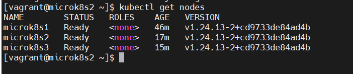

## Vagrant - Provisionando um cluster Kubernetes MicroK8s de alta disponibilidade

Será criado de forma rápida e objetiva, um cluster Kubernetes com MicroK8s.

Tudo que for implementado ou criado na pasta raiz desse tutorial, já ficará disponível dentro do diretório das VMs em:

**/home/vagrant/projeto**

### Observação

Vagrant só é recomendado para ambientes de testes e desenvolvimento, conforme pode ser visto no link abaixo.

https://developer.hashicorp.com/vagrant/intro/vs/terraform

### Versões de softwares utilizados nesse tutorial

SO Windows 11, Vagrant 2.3.3 e VirtualBox 7.0.6

### Requisitos mínimos

Ter em seu SO os seguintes softwares.
Abaixo de cada um segue o link para download.

- VirtualBox (Software de virtualização)

  https://www.virtualbox.org/wiki/Downloads

- Vagrant (Software para configurar ambientes)

  https://developer.hashicorp.com/vagrant/downloads

- Putty (Software de cliente remoto)

  https://www.chiark.greenend.org.uk/~sgtatham/putty/latest.html

- Vagrant - plugin vbguest, via linha de comando, execute:

  vagrant plugin install vagrant-vbguest

- Ter 3 VMs com CentOS 7, 2 CPUs e 3GB RAM cada

  | Hostname   | IP       |
  | :---------- | :--------- |
  | microk8s1 | 192.168.56.150 |
  | microk8s2 | 192.168.56.151 |
  | microk8s3 | 192.168.56.152 |

  Recomendo seguir o tutorial abaixo, que nele você só terá que anexar o **script.sh** (detalharei mais abaixo esse arquivo) no arquivo **Vargrantfile** e o Vagrant fará todo o resto para você.

  O **script.sh** tem tudo que é preciso para instalar o MicroK8s no CentOS 7.

  https://github.com/tiagotsc/vagrant-vms_group

### Observação

Se você seguiu o passo a passo do tutorial https://github.com/tiagotsc/vagrant-vms_group, você já terá as VMs com o MicroK8s instalado e prontas para uso.

### Com as VMs criadas e MicroK8s rodando, siga as etapas

1 - Abra o putty e forneça o IP da primeira VM, no exemplo, vou acessar a VM **microk8s1**:

**IP:** 192.168.56.150

**Usuário:** root ou vagrant

**Senha:** vagrant


2 - Já dentro da VM **microK8s1**, execute o seguinte comando 2 vezes para gerar os tokens para cada VM.


Cada token só pode ser rodado em uma única VM e serve para adicionar a VM no cluster Kubernetes MicroK8s.

3 - Copie o primeiro token, logue com o putty na VM **microk8s2**, através do seu IP **192.168.56.151**.

4 - Dentro da VM **microk8s2**, adicione o token e espere o termino da operação.


Operação finalizada, VM **microk8s2** já está no cluster MicroK8s.

5 - Copie o segundo token e repita os passos **3** e **4** na VM **microk8s3**.

6 - Após adicionar o token em cada VM, em qualquer uma delas, execute:

```bash
# Lista todos os nós do cluster Kubernetes
kubectl get nodes
```



### Seu cluster Kubernetes já está pronto para uso!!!

Vamos dar uma olhada no status do cluster, em qualquer VM, execute o comando:

```bash
# Visualizar o status do cluster Kubernetes
microk8s status
```


Como pode ser visto o modo alta disponibilidade já ficou ativo devido ao fato de montarmos um cluster com 3 nós.

Para ativar a HA é preciso ter no mínimo 3 nós.

## Alguns comandos úteis

### MicroK8s (Execute dentro de cada VM)

```bash
# Desliga cluster
microk8s stop

# Ligar cluster
microk8s start

# Visualizar status do cluster
microk8s status

# Desativa o nó, execute esse comando dentro do nó que deseja desativar
microk8s leave

# Depois que o nó já está desativado, de um nó ativo, remova o nó desativado de fato do cluster
microk8s remove-node IP_NÓ ou HOSTNAME_NÓ
```

### Vagrant (Execute na máquina host que hospeda as VMs)

Via linha de comando, é preciso estar na pasta "**projeto**", pasta onde está o **Vagrantfile**,  para executar os comandos:

```bash
# Desliga VMs
vagrant up

# Reiniciar VMs
vagrant reload

# Destruir VMs, peguntando antes
vagrant destroy

# Destruir VMs, direto sem perguntar
vagrant destroy -f
```

Todo o tutorial aplicado aqui, já se encontra pronto para uso nesse repositório, basta clonar e subir o ambiente.

#### Documentação oficial do Vagrant

https://developer.hashicorp.com/vagrant/docs

MicroK8s

https://microk8s.io/docs

## 🔗 Links
[](https://www.linkedin.com/in/tiago-s-costa)
